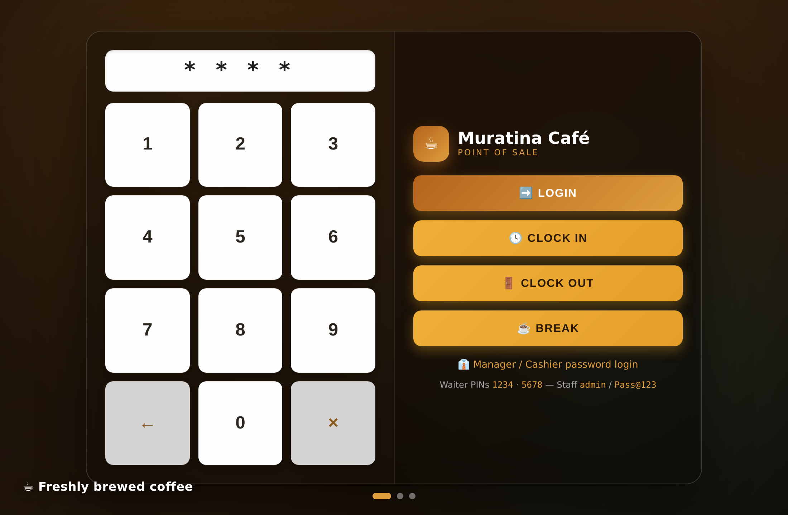

# ☕ Muratina Café — Restaurant & Café POS System

A modern, responsive Point of Sale system for restaurants, cafés, juice bars and
meal businesses. Built with **PHP 8 + MySQL + Bootstrap 5**, designed to run on
**Laragon** (or any Apache/Nginx + MySQL stack).

  

---

## 🖼️ Visual Blueprint

Design previews of the key screens (light & dark themes, desktop & mobile) live
in [`docs/blueprint/`](docs/blueprint):

| | |
|---|---|
| **Login Terminal** — PIN keypad + Clock In/Out/Break, video background | **Dashboard** — KPIs + charts |
|  |  |
| **POS Sales** — grid + cart + payments | **Thermal receipt** — printed (80mm) |
|  |  |
| **Products** — searchable catalogue | **Reports** — CSV/Excel/PDF export |
|  |  |
| **Dashboard (Dark mode)** | **Thermal receipt** — bold, 80mm |
|  |  |
| **Responsive (mobile POS)** | |
|  | |

> These are design renders of the actual `assets/css/style.css`. The live app
> looks identical once running on Laragon, with Font Awesome icons (shown here
> as emoji) and live Chart.js charts.

---

## ✨ Features

| Area | What's included |
|------|-----------------|
| **Login** | YUMAPOS-style terminal: **PIN keypad** sign-in + **Clock In / Out / Break** over a cinematic cross-fading video background (coffee · juice · meals). Toggle to **password login** for managers/cashiers |
| **Roles** | Manager (full), Cashier (POS), **Waiter** (POS via PIN), Inventory Officer (stock) — role-based access control |
| **Waiters** | Manager registers a waiter with just a **name + passcode (PIN)**. Each waiter signs in with their own PIN, and their name prints on every receipt they serve |
| **Attendance** | Staff **Clock In / Out / Break** straight from the login screen using their PIN; managers review it via the **Attendance report** |
| **Dashboard** | 6 KPI cards + daily sales, top products, revenue trend charts (Chart.js), recent activity |
| **POS** | Touch-friendly product grid, category filter, live search/barcode, cart, discounts, notes, 4 payment methods, server-side stock validation in a DB transaction |
| **Products** | Full CRUD, image upload, SKU/barcode, supplier, expiry, low-stock marks, search & filter |
| **Categories** | Default Coffee/Tea/Juice/Meals/Snacks/Desserts + unlimited custom with icons |
| **Inventory** | Stock In/Out, movement history, low-stock alerts |
| **Suppliers** | CRUD supplier directory |
| **Customers** | CRUD, purchase history, loyalty points (auto-awarded on sale) |
| **Users** | Create/edit/delete, activate/deactivate, reset password, login history, audit logs |
| **Reports** | Daily / Monthly / Product / Inventory / Profit / Cashier / **Attendance** — export to **CSV, Excel, PDF** |
| **Receipts** | Print, save-as-PDF, WhatsApp share; configurable name, header note, width (80/58mm) & line toggles |
| **Settings** (manager only) | Tabbed panel: **General** (system name, logo, currency, KRA PIN, **day/night** default theme), **Sales & Tax** (tax %, service charge %, loyalty rate, low-stock default, session timeout), **Receipt** (name, header note, footer, width, show/hide logo·tax·served·customer), **Security** (change own password, set **manager PIN**, reset user passwords) |
| **Security** | Bcrypt password hashing, CSRF tokens, PDO prepared statements, session timeout, activity logging, RBAC |
| **UI/UX** | Glassmorphism, **dark/light mode**, fully responsive, sidebar + topbar, smooth animations |
| **PWA** | Installable as a **desktop / mobile app** (manifest + service worker), app icons, offline shell, and an in-app **Install** button |

---

## 📲 Install as an app (PWA)

Muratina POS is a Progressive Web App, so it can be installed like a native app:

- **Desktop (Chrome/Edge):** open the site, then click the **Install** button
  (bottom-right) or the install icon in the address bar.
- **Android (Chrome):** menu → *Install app* / *Add to Home screen*.
- **iOS (Safari):** Share → *Add to Home Screen*.

It launches in its own window (no browser chrome), keeps a cached app shell, and
shows a friendly offline page when there's no connection. Installability needs
`https://` **or** `http://localhost` (Laragon's localhost works out of the box).

---

## 🚀 Setup (Laragon)

1. **Copy the project** into Laragon's web root:
   ```
   C:\laragon\www\Muratinacaffe
   ```

2. **Start** Apache & MySQL from the Laragon control panel.

3. **Create the database.** Open `http://localhost/phpmyadmin` (or Laragon's
   *Database* tool) and import:
   ```
   database/schema.sql
   ```
   This creates the `muratina_pos` database with tables, demo products,
   categories, suppliers, customers and three demo users.

4. **Check the DB credentials** in `config/config.php`. Laragon defaults
   (`root` / empty password / `127.0.0.1`) work out of the box. You can also
   override via environment variables `DB_HOST`, `DB_NAME`, `DB_USER`, `DB_PASS`.

5. **Open the app:**
   ```
   http://localhost/Muratinacaffe/
   ```

> Running without Laragon? From the project folder:
> `php -S localhost:8000` then visit `http://localhost:8000` — just make sure a
> MySQL server is reachable with the credentials in `config/config.php`.

---

## 🔑 Demo Accounts

Staff accounts use the password **`Pass@123`**. Waiters sign in on the **Waiter**
tab with their PIN.

| Login | Role | How to sign in | Access |
|-------|------|----------------|--------|
| `admin` | Manager | password `Pass@123` **or** PIN `194825` | Everything |
| `cashier` | Cashier | password `Pass@123` | POS, own sales, receipts, customers |
| `inventory` | Inventory Officer | password `Pass@123` | Products, stock, suppliers |
| Brian Waiter | Waiter | **PIN `1234`** | POS, own sales, receipts, customers |
| Aisha Waiter | Waiter | **PIN `5678`** | POS, own sales, receipts, customers |

> Already imported the old schema? Run `database/migration_waiter.sql` to add the
> waiter role and PIN column. Change these passwords/PINs before going live.

---

## 📁 Project Structure

```
Muratinacaffe/
├── index.php              # Login page (video slideshow background)
├── dashboard.php          # KPIs + charts
├── pos.php                # Point of Sale screen
├── products.php           # Product management
├── categories.php         # Category management
├── inventory.php          # Stock movements & low-stock alerts
├── suppliers.php          # Supplier directory
├── customers.php          # Customers + loyalty + history
├── users.php              # User management, login history, audit log
├── reports.php            # Reports + CSV/Excel/PDF export
├── settings.php           # Company settings
├── receipt.php            # On-screen receipt (print / PDF / WhatsApp)
├── logout.php
├── api/
│   ├── process_sale.php   # Atomic sale transaction endpoint
│   └── receipt_pdf.php    # Printable PDF receipt
├── config/
│   ├── config.php         # App + DB configuration
│   └── database.php       # PDO connection (singleton)
├── includes/
│   ├── auth.php           # Auth, RBAC, session timeout
│   ├── functions.php      # Helpers: CSRF, escaping, settings, audit
│   ├── header.php         # Sidebar + topbar layout
│   └── footer.php
├── assets/
│   ├── css/style.css      # Glassmorphism + dark/light theme
│   └── js/app.js          # Theme toggle, sidebar, helpers
├── uploads/               # Product images & logo (gitignored)
└── database/
    └── schema.sql         # Schema + seed data
```

---

## 🔒 Security Notes

- Passwords are stored with `password_hash()` (bcrypt) — never in plain text.
- Every state-changing request is protected by a per-session **CSRF token**.
- All queries use **PDO prepared statements** (no string-concatenated SQL).
- Sessions idle-timeout after 30 minutes (configurable in `config.php`).
- Sale processing runs inside a transaction with `SELECT … FOR UPDATE` to
  prevent overselling under concurrent checkouts.

---

## 🛣️ Roadmap / Bonus ideas

Barcode scanner support (search box already accepts scanner input), live M-Pesa
STK push, QR-code payments, multi-branch, employee attendance, and sales
forecasting are natural next steps on top of this foundation.

---

Made with ☕ for modern cafés, restaurants and juice bars.
